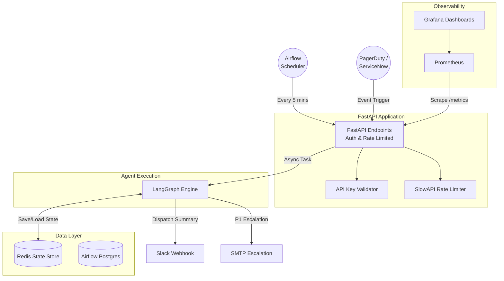
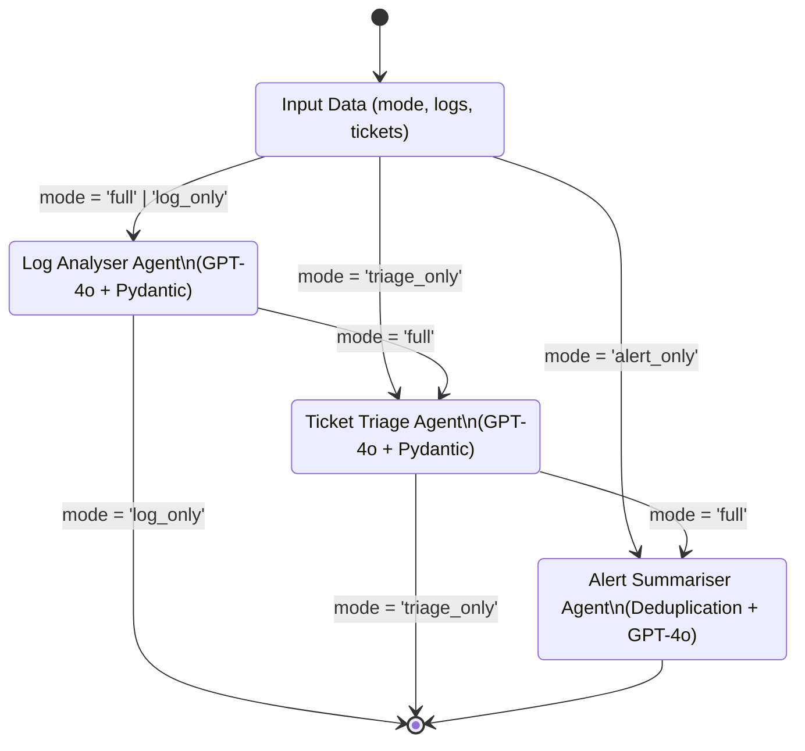
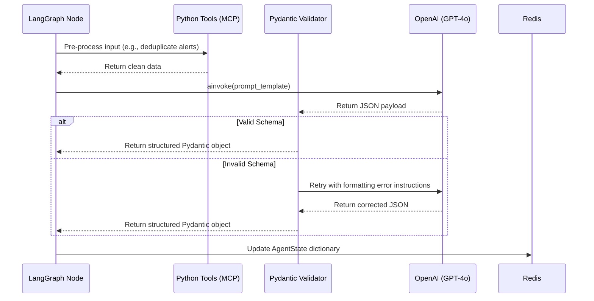

# System Architecture Diagrams

This document visually represents the core architecture of the Multi-Agent IT Ops Assistant using Mermaid.js diagrams.

## 1. High-Level System Topology

This diagram shows how the external systems, orchestrator, and AI agents interact.

## 2. LangGraph State Machine (Conditional Routing)

This diagram illustrates the conditional routing logic implemented in `src/graph/workflow.py`. The graph dynamically prunes execution paths based on the `mode` parameter to save LLM tokens and reduce latency.

## 3. Agent Execution Flow (Single Node)

When a specific agent (e.g., Log Analyser) is invoked, it follows a strict sequence of operations:

